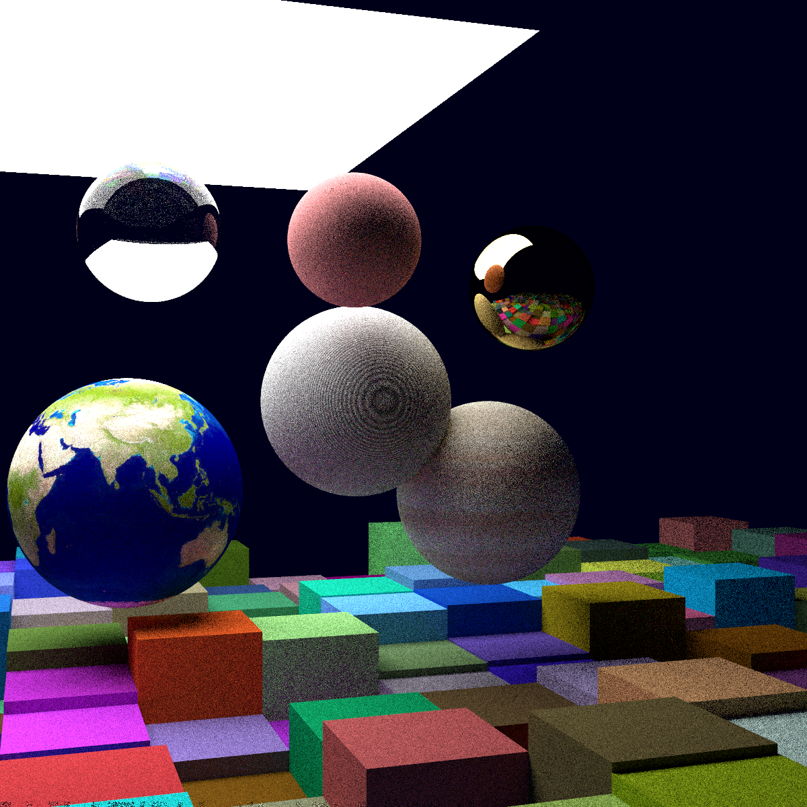
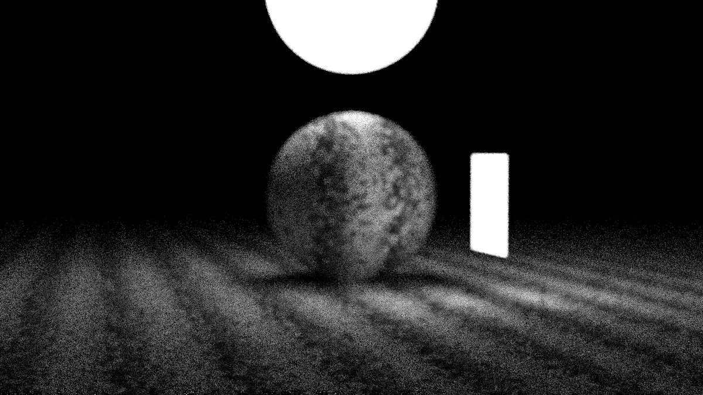
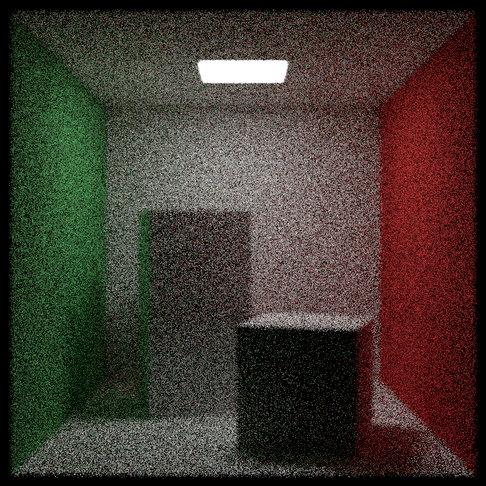

# CUDA Ray Tracer
My implementation of the [Ray Tracing in One Weekend](https://raytracing.github.io/) series in CUDA.

## References
https://raytracing.github.io/
https://developer.nvidia.com/blog/accelerated-ray-tracing-cuda/
